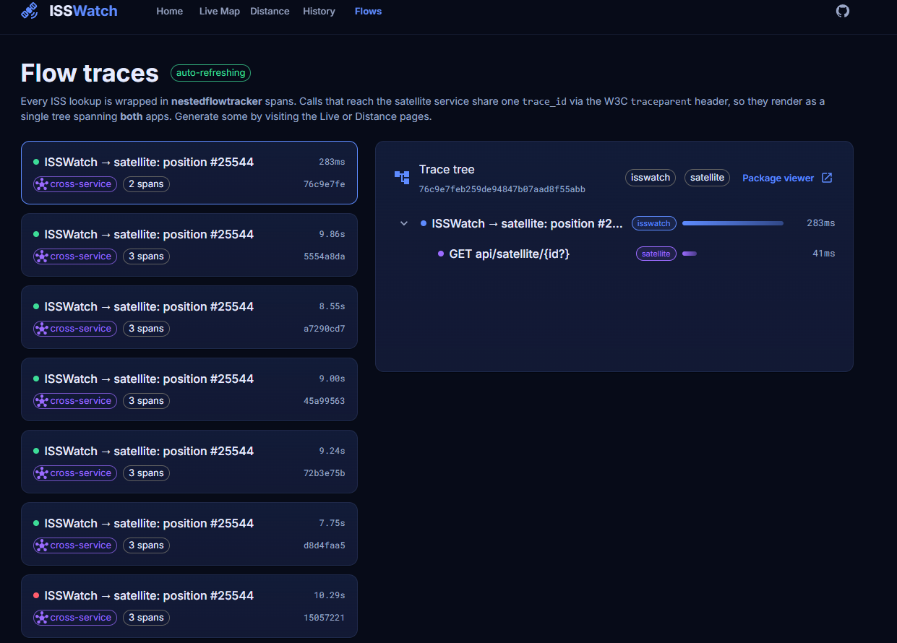

# ISSWatch

A live International Space Station tracker built to **showcase two repositories as a single demo**:

- **[satellite](https://github.com/adelinferaru/satellite)** — a Laravel REST API returning the ISS's
  live position/velocity/altitude and slant-range distance from any coordinate. ISSWatch runs against
  **[satellite-demo](https://github.com/adelinferaru/satellite-demo)**, the nestedflowtracker-instrumented
  variant.
- **[nestedflowtracker](https://github.com/adelinferaru/nestedflowtracker)** — a zero-infra flow
  tracer. Every request here is wrapped in spans, and calls that cross into the satellite service
  share one `trace_id` (via the W3C `traceparent` header) so they render as a **single trace tree
  spanning both apps**.

ISSWatch itself is **Laravel 13 + Inertia + React + TypeScript + MUI**.



## Architecture

```
Browser ──Inertia/axios──▶ ISSWatch (Laravel 13 + React/MUI)
                                │  Http::withFlowTrace()  (propagates traceparent)
                                ▼
                           satellite-demo API (Laravel 13)
                                │
                                ▼
                           api.wheretheiss.at

ISSWatch       ─┐
                ├─▶  shared flow store (SQLite in dev / MySQL in prod)  ◀─ /flows dashboard
satellite-demo ─┘        (both write nestedflowtracker spans here → one unified trace)
```

## Pages

- **/** — showcase landing explaining both repos.
- **/live** — real-time ISS position on a Leaflet map with a fading ground track.
- **/distance** — slant-range distance from your coordinates (geolocation or manual).
- **/history** — sample past positions over a window and chart altitude/velocity (`@mui/x-charts`).
- **/flows** — the flow-trace dashboard: every lookup as a **cross-service trace tree**. The package's
  own viewer is also available at **/flow**.

## Requirements

- PHP **8.3+** (Laravel 13)
- Composer 2.x
- Node 20+ / npm
- A running **satellite-demo** instance (the upstream ISS API)

## Local development

Clone both apps and start the upstream first:

```bash
git clone https://github.com/adelinferaru/satellite-demo
git clone https://github.com/adelinferaru/isswatch

# --- satellite-demo (the upstream ISS API) ---
cd satellite-demo
composer install
cp .env.example .env && php artisan key:generate
touch database/database.sqlite && php artisan migrate
php artisan serve --port=8001          # http://127.0.0.1:8001

# --- ISSWatch (in a second checkout) ---
cd ../isswatch
composer install && npm install
cp .env.example .env && php artisan key:generate
touch database/database.sqlite && php artisan migrate
# set SATELLITE_BASE_URL=http://127.0.0.1:8001 in .env
php artisan serve --port=8000          # http://127.0.0.1:8000
npm run dev                            # Vite dev server (HMR), in a third terminal
```

For a production-style front end instead of Vite HMR, run `npm run build` and skip `npm run dev`.

### Shared flow store (local)

For the cross-service `/flows` tree to work, both apps must write their spans to **one** store. In
dev that's a shared SQLite file: set the **same absolute** `FLOW_DB_DATABASE` path in both apps'
`.env` (with `FLOW_DB_DRIVER=sqlite`, `FLOW_CONNECTION=flow`), then create it once:

```bash
php artisan migrate --database=flow --path=database/migrations
```

### A note on the upstream

`api.wheretheiss.at` can be slow or briefly unreachable from some networks. satellite-demo copes by
caching each **successful** fix for `ISS_CACHE_SECONDS` and waiting up to `ISS_HTTP_TIMEOUT` for the
response; ISSWatch waits `SATELLITE_TIMEOUT` for satellite-demo. Tune these in the respective `.env`
files. The Live page also skips a poll while a previous one is still in flight.

## Deploying to Laravel Cloud

Run **ISSWatch** and **satellite-demo** as two apps in one [Laravel Cloud](https://cloud.laravel.com)
project. Cloud builds from GitHub (it runs `npm run build` for ISSWatch automatically), and
scale-to-zero keeps an idle demo cheap. Its managed database is **PostgreSQL**; both apps share one
Postgres database for the cross-service trace store.

1. **Databases** — on your Postgres cluster create three databases: `isswatch` and `satellite` (each
   app's own data) and **`flow_shared`** (the shared trace store both apps write to).
2. **satellite-demo app** — connect `adelinferaru/satellite-demo` and attach the `satellite` database
   (Cloud injects `DB_*`). Then set:
   ```dotenv
   APP_ENV=production
   APP_DEBUG=false
   DB_CONNECTION=pgsql
   FLOW_COMPONENT=satellite
   FLOW_AUTO_HTTP=false
   FLOW_DB_DRIVER=pgsql
   FLOW_DB_DATABASE=flow_shared       # host/port/user/pass inherit from DB_* on the same cluster
   ```
   Deploy command:
   `php artisan migrate --force && php artisan migrate --database=flow --path=database/migrations --force`
3. **ISSWatch app** — connect `adelinferaru/isswatch` and attach the `isswatch` database. Same flow
   settings (point at the **same** `flow_shared`), plus:
   ```dotenv
   APP_ENV=production
   APP_DEBUG=false
   DB_CONNECTION=pgsql
   FLOW_COMPONENT=isswatch
   FLOW_DB_DRIVER=pgsql
   FLOW_DB_DATABASE=flow_shared
   SATELLITE_BASE_URL=https://<your satellite-demo app URL>
   ```
   Deploy command: same two `migrate` lines as above (the Vite build runs automatically).

Notes:
- The flow store's host/port/user/password **inherit from each app's `DB_*`**, so you only set
  `FLOW_DB_DRIVER` + `FLOW_DB_DATABASE`. (To put the trace store on a different cluster, set the full
  `FLOW_DB_HOST`/`FLOW_DB_PORT`/`FLOW_DB_USERNAME`/`FLOW_DB_PASSWORD`.)
- Cloud runs `config:cache` on deploy; every setting here is read via `config()`, so it survives it.
- The flow migration against `flow_shared` is idempotent, so running it from both apps is safe.
- With scale-to-zero, the first request wakes ISSWatch (<500 ms); its first chained call also wakes
  satellite-demo — a one-time blip.
- The `viewFlow` gate is open (public showcase) — tighten it in
  `app/Providers/AppServiceProvider.php` to restrict who can see `/flow`.

Visit the ISSWatch app URL → `/flows` shows the single cross-service tree spanning both apps. (The
same env vars work on Forge/Railway with `mysql` instead of `pgsql`.)

## Tests

```bash
php artisan test
```

`tests/Feature/SatelliteClientTest.php` covers the traced proxy with `Http::fake()` — envelope
unwrapping, `traceparent` propagation, validation→exception mapping, and the JSON proxy endpoints.

## Key files

- `app/Services/SatelliteClient.php` — traced HTTP client to satellite-demo (`Http::withFlowTrace`, spans).
- `app/Http/Controllers/IssProxyController.php` — JSON endpoints the React pages poll.
- `app/Http/Controllers/FlowController.php` — reads the shared store, builds the nested trace tree.
- `resources/js/pages/*.tsx` — the five pages; `components/SpanTree.tsx` renders the trace tree.
- In **satellite-demo**: `app/Http/Middleware/ContinueFlowTrace.php` links its root span to the inbound
  caller's span (via nestedflowtracker 3.1's `options['parent_span_id']`) so the trace is one tree.
